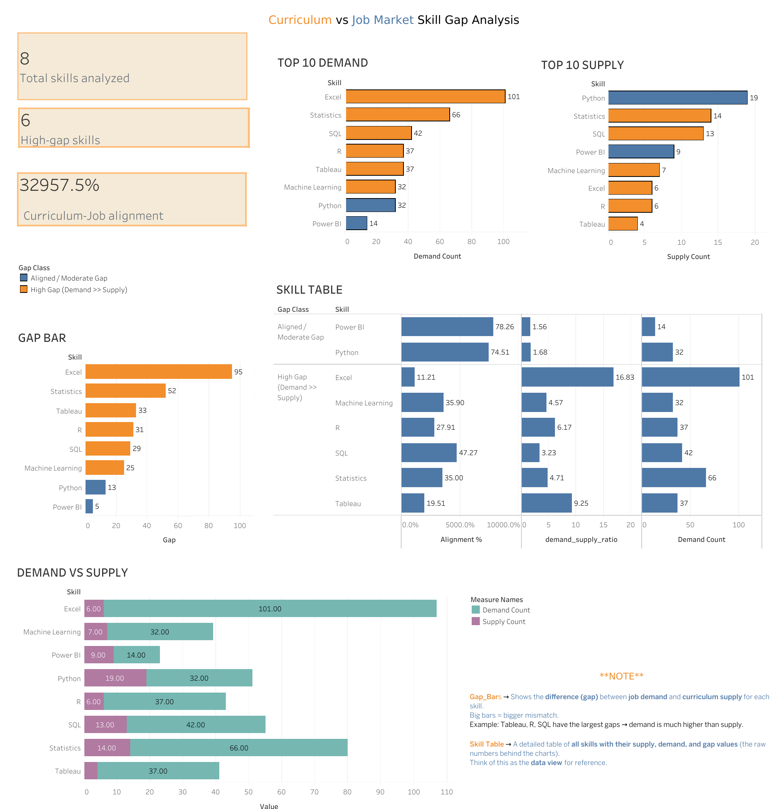

# Skill Gap Analyzer (Tableau Dashboard)

## 📌 Overview
This project analyzes workforce skills demand vs supply and identifies high-gap skills.  
It was built in **Tableau** using sample HR data.

## 📊 Features
- KPIs (Total Skills, High-Gap Count, Alignment)
- Top 10 skills in demand vs supply
- Gap analysis bars + detailed skill table
- Interactive filters (click-to-filter)
- Global filters applied across dashboard

## 🖼️ Dashboard Preview

## 📂 Files
- `Skill_Gap_Analyzer.twbx` → Tableau Packaged Workbook
- - `new-folder` → Source dataset and cleaned version of it
- `output/skills_gap_comparison.csv` → Main dataset
- `dashboard.png` → Dashboard images

## 🚀 How to View
1. Download Tableau Public (free).
2. Open `skill gap analyzer TEXTBOOK.twbx`.
3. Or view online here: [Tableau Public Link](your-link-here)

## 📌 Insights
- High gap in cloud and AI skills.
- Alignment is strong in legacy IT skills.
- Employers should prioritize training in high-gap areas.
